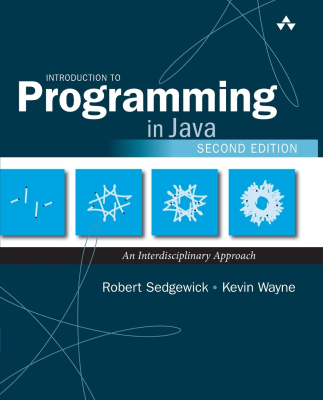

<h1 align="center">Introduction to Programming in Java</h1>

     
    
     

 

    
    
    
    
    

## Resources

- [Introduction to Programming in Java, 2nd Edition](https://introcs.cs.princeton.edu/java/home/)
- [Java SE 17 & JDK 17 API Specification](https://docs.oracle.com/en/java/javase/17/docs/api/index.html)

## Related Projects

- [Computer Science](https://github.com/kserbouty/computer-science)
- [Algorithms](https://github.com/kserbouty/algorithms)

## Roadmap

- [ ] [Chapter 1: Elements of Programming](https://introcs.cs.princeton.edu/java/10elements)
- [ ] [Chapter 2: Functions](https://introcs.cs.princeton.edu/java/20functions)
- [ ] [Chapter 3: Object-Oriented Programming](https://introcs.cs.princeton.edu/java/30oop)
- [ ] [Chapter 4: Algorithms and Data Structures](https://introcs.cs.princeton.edu/java/40algorithms)

## License

This project is released under the [MIT License](./LICENSE.md).
