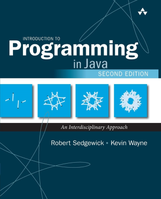

<h1 align="center">Introduction to Programming in Java</h1>

     
    
     

 

    
    
    
    

## About

Approach to the traditional CS1 curriculum, using Java with materials from science to internet commerce.

Textbook coauthored by [Robert Sedgewick](https://www.cs.princeton.edu/people/profile/rs) and [Kevin Wayne](https://www.cs.princeton.edu/people/profile/wayne) at Princeton University.

## Resources

- [Introduction to Programming in Java, 2nd Edition (Princeton)](https://introcs.cs.princeton.edu/java/home/)
- [Java SE 21 & JDK 21 API Specification (Oracle)](https://docs.oracle.com/en/java/javase/21/)

## Roadmap

- [ ] [Chapter 1: Elements of Programming](https://introcs.cs.princeton.edu/java/10elements)
- [ ] [Chapter 2: Functions](https://introcs.cs.princeton.edu/java/20functions)
- [ ] [Chapter 3: Object-Oriented Programming](https://introcs.cs.princeton.edu/java/30oop)
- [ ] [Chapter 4: Algorithms and Data Structures](https://introcs.cs.princeton.edu/java/40algorithms)

## License

This project is released under the [MIT License](./LICENSE.md).
